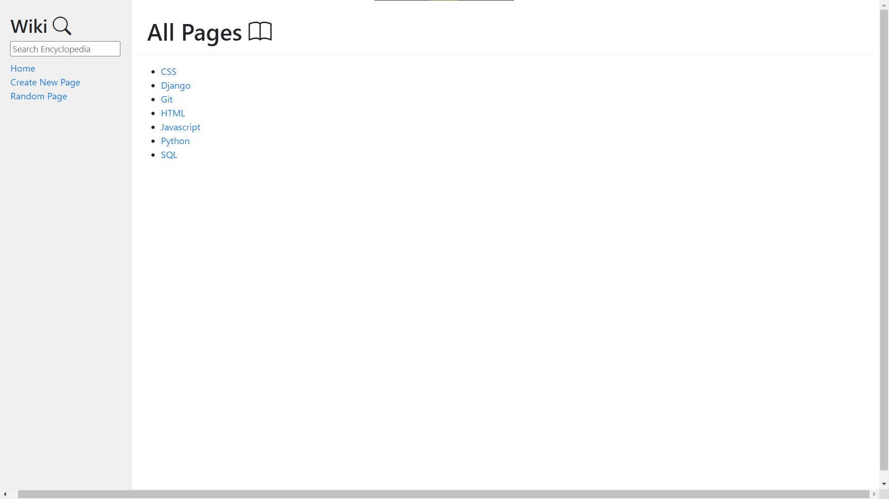

# Wiki
CS50w Wiki Project.

## Get Started
The course second project consists of a **Wiki application**, build in **Django**, where the users can read and create encyclopedia entries formatted in **Markdown markup language**. As custom additional features, I implemented a **search bar**, where the user can get the entries resembles the keywords entered.

In order to install and run it, follow the steps given bellow.

## Prerequisites
- Last versions of [Python](https://www.python.org/) and [Django](https://www.djangoproject.com/);
- Python's markdown package (install with `pip install markdown`);

## Installing and running
- Clone this repository with `https://github.com/William-Fernandes252/Wiki.git`;
- Inside of `/Wiki` run `python manage.py runserver`;
- Finally, go to [http://127.0.0.1:8000](http://127.0.0.1:8000) in your browser.

## Project Snapshot

<h3 align="center">Entry page</h3>

<h3 align="center">Create new entry page</h3>

<h3 align="center">Edit entry page</h3>

